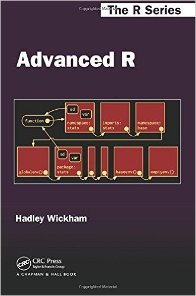

```{r setup, include=FALSE}
knitr::opts_chunk$set(echo = TRUE, comment = "#")
```

## Sources {#cover}

La **TRES** grande majorité des informations données ici sont issues du livre d'Hadley Wickham : **Advanced R**.

Clairement la référence (en Anglais !) en "vulgarisation"" des fonctionnalités avancées de R.

<div class="centered">


[http://adv-r.had.co.nz/](http://adv-r.had.co.nz/)
</div>

Livre consultable intégralement en ligne, ou achetable sur internet (Amazon...)

## Une fonction : présentation simple
Dans R, **une fonction est un objet**, au même titre qu'un vecteur, un dataframe, une liste...
Dans R, **tout est fonction dans R**, y compris '`+`' ou '`(`' ou encore '`if`'.

Une fonction permet de créer une version abstraite et réutilisable d'une solution que l'on souhaite appliquer à un problème donné.

Exemple de fonction basique:
```{r}
# Fonction renvoyant le carré d'une valeur
f <- function(x) {
  x^2
}
```

Exemple d'utilisation (= appel de la fonction) :
```{r}
f(2)
```

## Pourquoi utiliser des fonctions ?

### Grande facilité à réutiliser son code
Créer une fonction permet de **"s'extraire" du contexte** dans laquelle elle est créée.

On ne cherche plus à résoudre un problème précis, mais un **problème générique** : la fonction pourra être réutilisée dès qu'on sera confronté au même type de problème.

### Meilleure lisibilité

Le code est plus compact : toute la partie reproductible est encapsulée dans la fonction. Il ne reste qu'à passer les arguments et à manipuler la sortie.

### Maintenance plus aisée

La correction d'un bug au niveau d'une fonction permet de corriger le problème simultanément à tout les endroits où elle est utilisée (y compris dans d'autres projets par ex).

Des outils type `debug()` permettent aussi d'explorer plus finement le comportement d'une fonction, et de trouver souvent la source d'un problème.


## Les constituants d'une fonction {.reduceCode}
Une fonction est constitué de **3 principaux éléments** :

- Le **corps** : la définition de la fonction, accessible via `body()`
```{r echo=TRUE}
body(f)
```
- Les **arguments** : les paramètres qui sont utilisés par la fonction, accessible via `formals()`
```{r echo=TRUE}
formals(f)
```
- L'**environnement** : le contexte dans lequel la fonction est définie, accessible via `environment()`
```{r echo=TRUE}
environment(f)
```

## L'environnement

- GlobalEnv
- Environnements de la fonction : enclosing, execution, calling

## Le lexical scoping

Ensemble de règles permettant à `R` de faire correspondre une valeur à un symbole
```{r}
x <- 10
f <- function() {
  x <- 20
  x
}

x
f()
  
```

## Le lexical scoping

- Pacours des environnements

- Fonctions VS variables

- Variables éphémères

- Evaluation à l'exécution

Dynamic lookup + lazy evaluation

## La gestion des arguments

- Les arguments (formels et valeurs remplacées par exécution : appels)
- Les valeurs par défaut

## Les arguments

- Par leur nom complet
- Par leur nom partiel
- Par leur position (ordre dans la définition de la fonction)


## Les arguments
```{r}
f <- function(foo, bar) {
  c(foo, bar)
}
```

Possiblité de donner les argument en :

- Utilisant leurs noms complets
```{r, results='hide'}
f(foo = 1 , bar = 2)
```

- Utilisant une partie de leur nom (*partial matching*)
```{r, results='hide'}
f(f = 1, b = 2)
```

- Utilisant leur position dans la définition de la fonction
```{r, results='hide'}
f(1,2)
```

## Manipulation des arguments

- Récupération de la liste des arguments (formals)
- Test sur la présence/absence d'un argument

## Lazy evaluation
L'évaluation d'un argument ne se fait qu'à l'instant *t* où l'argument est utilisé
(et donc à l'instant *t* où l'évaluation devient nécessaire).
 
```{r}
f <- function(a = 1 , b = a*2) {
  a <- 6
  b
}
```

L'évaluation de `b` ne se fait qu'au moment de son utilisation 
(donc ici après l'affectation de la valeur 6 à `a`)
```{r}
f()
```

## Dot Dot Dot (`...`)

Argument spécial `...` qui permet de passer des arguments non spécifiés/déterminés à l'avance.

Utile par exemple quand on veut faire passer des arguments pour une fonction définie à l'intérieure d'une autre fonction

Attention : R ne peut pas alors vérifier si ce que vous passez est cohérent (= correspond bien à un argument nécessaire)
```{r}
f <- function(a, b, ...) {
  x <- sum(..., na.rm=T)
  c(a, b, x)
}

f(a = 1, b = 2, 3:30, 4:50)
```

## Valeur de retour 
Par défaut, une fonction retourne un objet **unique** qui est :

- Soit le résultat de la dernière évaluation
```{r}
f <- function(x) {
  x^2
}
f(2)
```
- Soit un résultat précis, choisi, par l'intermédiaire de `return()`
```{r}
f <- function(x){
  if(x%%2 == 0){
    return("x est un nombre pair")
  } else {
    return("x est un nombre impair")
  }
}
f(4)
```

## Gestion des valeurs de retour complexes 

- Création d'un objet list comme "véhicule"
- Utilisation des attributs

## Closures
Le résultat d'une fonction est un objet. Une fonction est un objet comme un autre.

--> Une fonction peut donc renvoyer une autre fonction : ce sont les **closures**.

```{r}
f <- function(x){
  g <- function(y){
    x^y
  }
}
```

```{r}
carre <- f(2)
carre(2)

cube <- f(3)
cube(2)
```

## Une fonction argument d'une fonction

